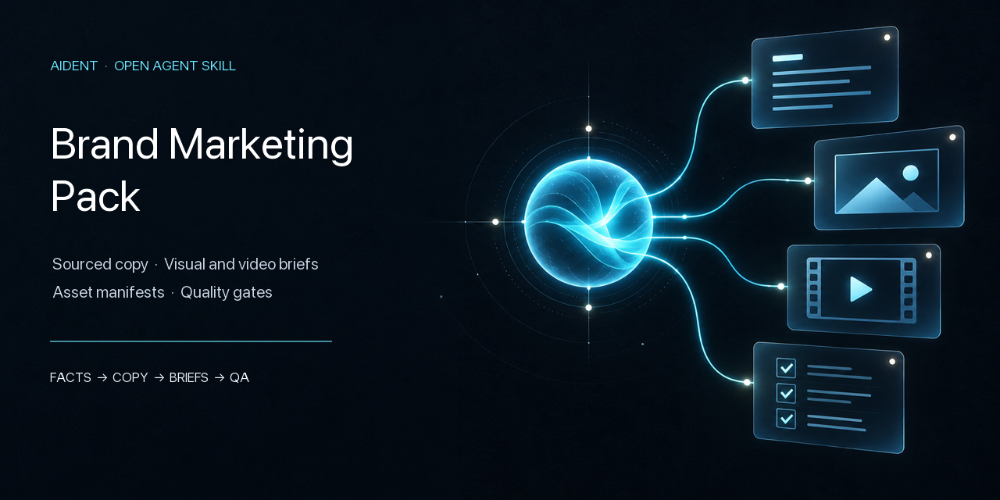

# Aident Brand Marketing Pack

An open, cross-agent Skill for building a complete, editable brand marketing asset library from either an existing brand or a new brand idea. Its default document follows the [anonymized reference-pack blueprint](aident-brand-marketing-pack/references/reference-pack-blueprint.md), without redistributing the source document's brand-specific content or media.

It writes the actual copy and packages permitted **full-quality finished image and video files**. The editable Lark, Google Docs, or Notion document displays those results where supported and points directly to durable companion files where needed. A source-page link, thumbnail, prompt, script, or storyboard is not a finished asset. **Editable PSD/AI/Figma projects and editing timelines are not included by default**; request a separate source-file handoff if needed.

## Two input routes

| Route | User provides | Result |
|---|---|---|
| `source-led` | Brand name with introduction/logo, official URL/social profile, existing document, or assets | Source-grounded pack preserving real identity and collecting permitted full-quality finished media files |
| `idea-led` | Product/brand idea without established identity or media | Proposed working brand and full copy; concepts remain clearly labeled until a separately authorized production workflow returns inspected final files |

A generic request defaults to `full-library`. The document includes English copy, official links and social channels, brand assets, launch video, video clips, creative rules, platform templates, workflow ideas, accuracy guardrails, and Chinese copy/media when requested. An explicitly narrow request may use a focused profile.

## The contract

```text
BRAND SOURCES
     │
     ▼
FACT LEDGER ──► BRAND CORE ──► FINAL COPY
     │               │              │
     └───────────────┴──────► ASSET MANIFEST
                                      │
                       ┌──────────────┴──────────────┐
                       ▼                             ▼
            EXISTING FINAL FILES              MISSING-MEDIA BRIEFS
                       │                             │
                       │                  AUTHORIZED SEPARATE PRODUCTION
                       │                             │
                       └──────────────┬──────────────┘
                                      ▼
                      EDITABLE DOC + FINAL FILE LIBRARY
```

| This Skill owns | A separate production Skill owns |
|---|---|
| Brand facts, positioning, message pillars, voice, terminology | Rendering and editing |
| Final website, social, ad, email, event, partner, and video copy | Model or renderer selection |
| Existing final-file collection, rights state, and durable pack placement | Layout implementation and animation |
| Visual and video briefs, prompts, scripts, shots, formats, safe areas | Working design or editing projects |
| Asset IDs, dependencies, final-file inspection, pack integration, and delivery QA | Generation/rendering and production-side export QA |

This split is intentional. Stable brand governance should not be coupled to a fast-changing image model, video generator, editor, or paid API.

## Modular profiles

| Profile | Use it for |
|---|---|
| `snapshot` | Compact brand core and claim guardrails |
| `copy-pack` | Canonical narrative and selected channel copy |
| `asset-inventory` | Existing logo, image, video, audio, document, and template index |
| `visual-kit` | Static-asset briefs with dependent copy and source assets |
| `video-kit` | Video concepts, scripts, shots, captions, and delivery contracts |
| `campaign-kit` | One campaign across selected copy and media formats |
| `full-library` | Default reference-shaped content and asset document |
| `refresh` | Evidence-aware updates that preserve stable approvals |

Operating modes are separate: `library` builds the source of truth and collects finished media, `handoff` freezes production contracts, and `refresh` revises only affected records. This Skill does not render media itself; when the user asks for new finished media, it can coordinate a separate authorized workflow and package its inspected results.

## Why visual and video templates stay here

The reusable templates in [`assets/visual-brief.yaml`](aident-brand-marketing-pack/assets/visual-brief.yaml) and [`assets/video-brief.yaml`](aident-brand-marketing-pack/assets/video-brief.yaml) describe what a good asset must communicate and how it will be accepted. Those contracts belong beside the brand facts and copy.

Actual Figma layouts, Canvas code, image-model recipes, motion components, editing timelines, caption pipelines, audio mixing, and export logic should live in independent Skills such as a future `aident-brand-visual-production` or `aident-brand-video-production`. This repository can hand off to either without becoming dependent on it.

## Reliability rules

- Evidence precedes copy.
- Every consequential claim carries a source, retrieval date, confidence, and dependent asset IDs.
- Short copy derives from one canonical narrative.
- Visual and video copy remains independently reviewable.
- Logo files, product UI, footage, rights, and approval ownership are explicit.
- The default media payload is ready-to-use final exports (for example PNG/JPEG/SVG and MP4/MOV), not editable design or video projects.
- An image or clip may be under 5 MB, but 5 MB is not a universal quality target or storage limit; inspect the actual file and provider cap.
- Prompts, concepts, scripts, and storyboards are never labeled as delivered media.
- Aident Loadout is the primary document route: check the current account, action, and Vault connection, create a native Lark Docx / Google Doc / Notion page, then read it back. Local Markdown is only a working backup.
- A full pack does not silently collapse to copy-only because images or footage are missing.
- A link-only document is a planning draft, not a ready media pack. Existing or newly produced media count as delivered only after the actual final file is inspected, durably stored, linked from the document, and access-checked.
- Explicitly narrow requests stay narrow.

## Cross-agent installation

The repository follows the open filesystem-based Agent Skills layout. The portable package is [`aident-brand-marketing-pack/`](aident-brand-marketing-pack/) and is not tied to Codex or one model.

Install with the open [`skills`](https://github.com/vercel-labs/skills) CLI:

```bash
npx skills add Edward-J-create/aident-brand-marketing-pack \
  --skill aident-brand-marketing-pack
```

Or install globally for detected agents:

```bash
npx skills add Edward-J-create/aident-brand-marketing-pack \
  --skill aident-brand-marketing-pack \
  --global \
  --agent codex claude-code cursor opencode \
  --yes
```

For manual installation, copy the complete package directory—not only `SKILL.md`—to the host's personal or project Skill directory. Hosts may ignore [`agents/openai.yaml`](aident-brand-marketing-pack/agents/openai.yaml); it is optional discovery metadata.

The portable core can draft content from accessible inputs, but a default run is not complete until Aident Loadout creates and reads back an editable online document **and verifies durable delivery of the actual final result files**. Use a host-native connector only when Aident cannot perform the requested operation, and disclose the route change. A connected/readable Lark account may still lack app-level Docx creation scopes; in that case the Skill checks another connected provider if the user did not require Lark. If none can write or hold the results, it reports delivery incomplete rather than silently downgrading to a local file or a page of source links. Follow the [Aident Loadout setup instructions](https://aident.ai/SETUP.md) when a connection is needed.

## Example requests

```text
Use $aident-brand-marketing-pack to build the full marketing pack from our
brand name, logo, introduction, and official website. Follow the reference
category structure, use real existing assets, brief missing visuals/videos,
and deliver one editable Lark document.
Include the actual full-quality final image and video files where rights and access permit;
do not include editable design or editing projects unless I request them separately.
```

```text
Use $aident-brand-marketing-pack for a new idea: matching accessories for
people and pets. We have no name, logo, website, or media yet. Propose a
working identity, write the full Chinese and English pack, label all media
concepts honestly, and create an editable online document.
```

```text
Use $aident-brand-marketing-pack to build an English copy pack from our website.
Include only the website one-liner, LinkedIn launch post, and three ad variants.
Deliver an editable Google Doc through Aident Loadout and show the evidence behind factual claims.
```

```text
Use $aident-brand-marketing-pack to inventory the assets in this Lark document.
Create production-ready briefs for one 16:9 hero banner, one 1:1 ad, and one
15-second launch video. Write all required copy, but do not render media.
```

```text
Use $aident-brand-marketing-pack in handoff mode. Freeze the approved copy,
logo sources, formats, and acceptance checks for the three selected assets.
Prepare the package for a separate visual/video production workflow.
```

## Package structure

```text
aident-brand-marketing-pack/
├── SKILL.md
├── agents/
│   └── openai.yaml
├── assets/
│   ├── asset-manifest.yaml
│   ├── brief.yaml
│   ├── video-brief.yaml
│   └── visual-brief.yaml
└── references/
    ├── copy-module.md
    ├── document-delivery.md
    ├── evidence-and-research.md
    ├── host-compatibility.md
    ├── image-module.md
    ├── original-media-delivery.md
    ├── output-template.md
    ├── production-handoff.md
    ├── quality-gates.md
    ├── reference-pack-blueprint.md
    ├── scope-and-modules.md
    └── video-module.md
```

## Design references

The architecture borrows two strong patterns while keeping a narrower contract:

- [coreyhaines31/marketingskills](https://github.com/coreyhaines31/marketingskills): task-specific marketing modules, evidence-grounded creative batches, channel-aware copy, and concrete creative QA.
- [anthropics/skills](https://github.com/anthropics/skills): concise `SKILL.md` routing, progressive reference loading, reusable assets, and explicit boundaries between guidance and production.

Their rendering-oriented visual workflows informed the separation documented above: this Skill controls the brand and production contract; renderer-specific implementation stays independent.

## Validation

Run the dependency-free repository checks:

```bash
python3 scripts/validate_package.py
```

The same check runs in GitHub Actions. It validates public package limits, frontmatter, local links, placeholder hygiene, JSON metadata, banned media-generation capability tags, and exact parity between Aident action tags and [`loadout/metadata.json`](loadout/metadata.json). YAML parsing is also checked when PyYAML is installed; the deterministic Aident packager separately validates the complete package.

## License

[MIT](LICENSE.md)
